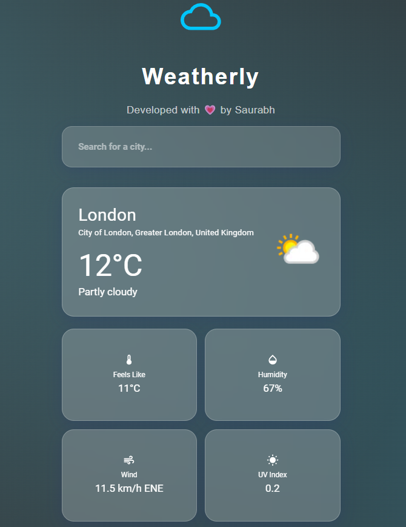

# Weatherly 🌤️

[](LICENSE)

A modern, responsive weather app built with **React**, **TypeScript**, and **Material UI**. Instantly search for cities and receive live weather updates in a glassmorphism design with dark mode support.

<p align="center">
  
</p>

## Table of Contents

- [Demo](#demo)
- [Features](#features)
- [Tech Stack](#tech-stack)
- [Installation](#installation)
- [Configuration](#configuration)
- [Usage](#usage)
- [Contributing](#contributing)
- [License](#license)
- [Author](#author)

## Demo

Live demo: [https://weatherly-three-self.vercel.app](https://weatherly-three-self.vercel.app/)

## Features

- 📡 Real-time city search with autocomplete
- 🎨 Glassmorphism UI & fully responsive layout
- 🌙 Light & Dark mode toggle
- 📈 Animated weather transitions (Framer Motion)
- 🔄 Smooth loading & error handling states

## Tech Stack

- **React** & **TypeScript**
- **Material UI** for components & theming
- **Axios** for HTTP requests
- **Framer Motion** for animations
- **WeatherAPI.com** for weather data

## Installation

1. Clone the repository:
   ```bash
   git clone https://github.com/your-username/weatherly.git
   cd weatherly
   ```
2. Install dependencies:
   ```bash
   npm install
   ```
3. Create a `.env` file from the example and add your WeatherAPI key:
   ```bash
   cp .env.example .env
   ```
4. Start the development server:
   ```bash
   npm start
   ```
5. Open [http://localhost:3000](http://localhost:3000) in your browser.

## Configuration

Rename `.env.example` to `.env` and update:
```env
REACT_APP_WEATHER_API_KEY=YOUR_WEATHERAPI_KEY
```
Sign up at [WeatherAPI.com](https://www.weatherapi.com/) for a free key.

## Usage

1. Type a city name (e.g., "New York") in the search bar.
2. Select from autocomplete suggestions.
3. View current weather details and enjoy smooth animations.

## Contributing

Contributions are welcome! Please read [CONTRIBUTING.md](CONTRIBUTING.md) for guidelines and code standards.

## License

Distributed under the MIT License. See [LICENSE](LICENSE) for more information.

## Author

Created with ❤️ by Your Name.
